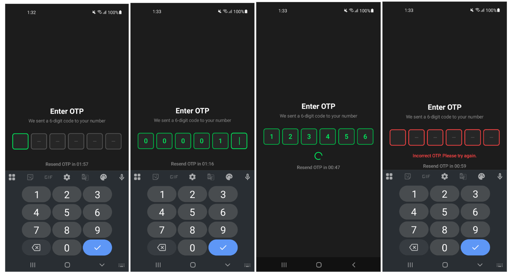
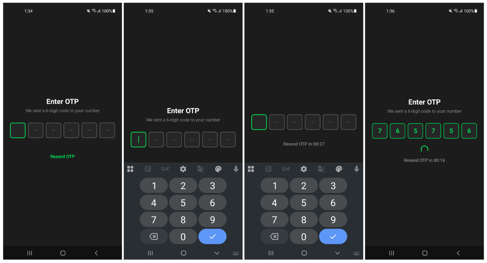
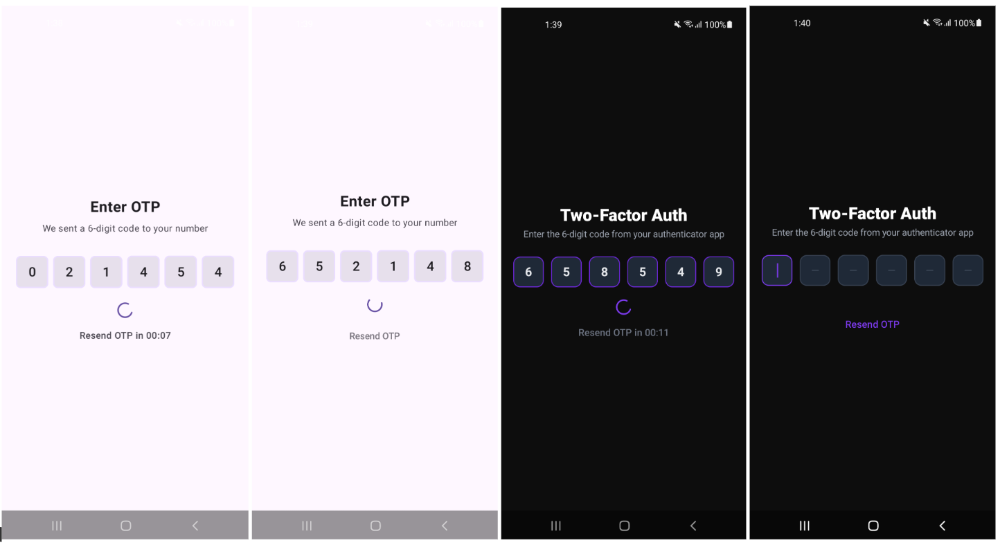
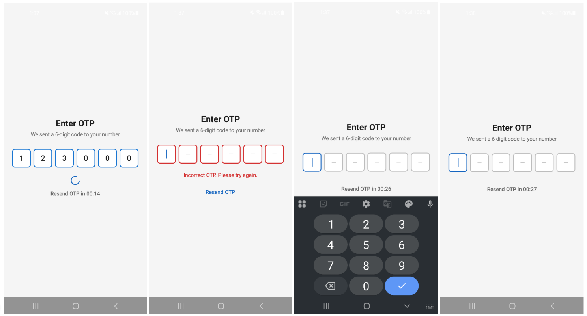
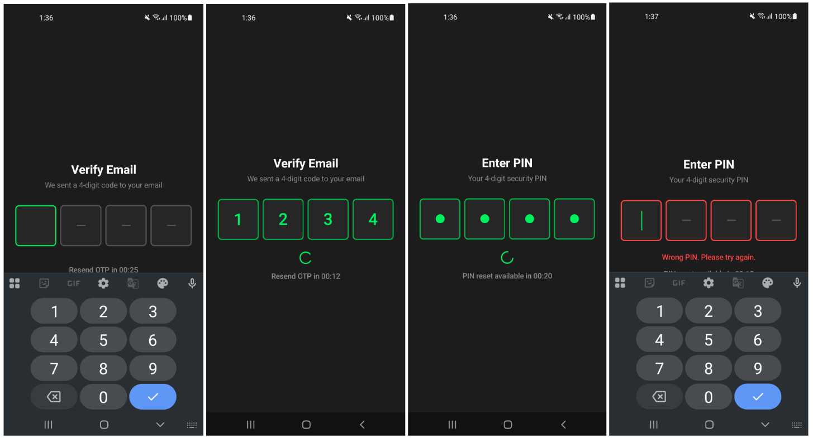

# OTPView

A production-ready, fully customizable OTP and PIN input component for Jetpack Compose. Built for real apps — not demos.

[](https://jitpack.io/#pinakcodestudio/OTPView)
[](https://opensource.org/licenses/MIT)
[](https://android-arsenal.com/api?level=21)
[](https://kotlinlang.org)
[](https://developer.android.com/jetpack/compose)

---

## What is OTPView?

OTPView is a single Jetpack Compose composable that handles everything an OTP or PIN screen needs — focus management, sequential input, backspace chains, clipboard paste, SMS auto-fill, a countdown resend timer, shake animation on failure, and auto-submission — without requiring any state management on the consumer's side.

Most OTP components in the Compose ecosystem require you to wire up a ViewModel, manage focus yourself, handle backspace edge cases, and build the resend timer from scratch. OTPView does all of that internally. The entire integration is a single composable call with one required parameter.

### What makes it different

**Every visual element is independently configurable.** Seven boolean flags for section visibility, sixteen color slots, sixteen typography parameters, six spacing parameters, and two built-in theme presets — all without touching any internal code.

**Rotation-safe, navigation-safe state.** State is persisted across configuration changes using `rememberSaveable` backed by a `@Parcelize` data class. When the screen is navigated away from, state is discarded automatically. No ViewModel, no manual lifecycle handling, no stale-state bugs in single-Activity navigation.

---

## Preview

### Default Dark Theme

Focus, sequential fill, verification spinner, and error state — out of the box with zero configuration.



### Resend Timer & Custom Timer Duration

The resend section counts down automatically. When it expires the button appears. Timer duration is fully configurable.



### Custom Themes — Light & Purple 2FA

Use the built-in `OtpTheme.light()` preset or pass any color set to match your brand. The last two panels show a fully custom purple 2FA screen driven by a single `OtpTheme(...)` call.



### Material3 Color Scheme

Pass `MaterialTheme.colorScheme` values directly into `OtpTheme` to automatically match your app's Material3 palette — including dark/light mode switching.



### 4-Digit OTP & Secure PIN Mode

Supports any `otpLength`. Set `isSecureInput = true` to show `●` bullets instead of digits for PIN entry flows.



---

## View-based (XML) project Integration

> **Using a View-based (XML) project?**
> Full setup instructions for `ComposeView`, `Activity`, `Fragment`, and navigation patterns are in the
> **[XML / View-based Integration Guide →](XML_README.md)**

---

## Compose based Integration

### Step 1 — Add JitPack to your repository list

In your root `settings.gradle.kts`:

```kotlin
dependencyResolutionManagement {
    repositoriesMode.set(RepositoriesMode.FAIL_ON_PROJECT_REPOS)
    repositories {
        google()
        mavenCentral()
        maven("https://jitpack.io")
    }
}
```

### Step 2 — Add the dependency

In your module's `build.gradle.kts`:

```kotlin
dependencies {
    implementation("com.github.pinakcodestudio:OTPView:1.0.0")
}
```

### Step 3 — Enable Compose (if not already)

In your module's `build.gradle.kts`, make sure `buildFeatures { compose = true }` is set and the Compose BOM is included. OTPView requires Compose BOM `2024.09.00` or higher.

```kotlin
android {
    buildFeatures { compose = true }
}

dependencies {
    implementation(platform("androidx.compose:compose-bom:2024.09.00"))
    implementation("com.github.pinakcodestudio:OTPView:1.0.0")
}
```

No ProGuard rules are needed in your app. OTPView ships a `consumer-rules.pro` file inside the AAR that keeps all required classes automatically.

---

## Quick Start

```kotlin
import com.pcs.otpview.api.OTPView
import com.pcs.otpview.api.OtpResult

OTPView(
    otpLength = 6,
    onVerify  = { otp ->
        val ok = apiService.verifyOtp(otp)
        if (ok) OtpResult.Success
        else    OtpResult.Failure("Incorrect OTP. Please try again.")
    },
    onSuccess = { navController.navigate("home") }
)
```

That is the complete integration. The keyboard opens immediately, focus routes automatically, the timer counts down, errors shake and clear the fields, and success navigates away — all managed internally.

---

## OTPView Parameters

Every parameter except `onVerify` has a default value and is optional.

| Parameter | Type | Default | Description |
|:---|:---|:---|:---|
| `otpLength` | `Int` | `6` | Number of digit input boxes. Any positive integer is valid. Common values: `4`, `6`. |
| `title` | `String` | `"Enter OTP"` | Headline text shown above the boxes. Hidden when `config.showTitle = false`. |
| `subtitle` | `String` | `"We sent a N-digit code to your number"` | Instruction text below the title. `N` is replaced with `otpLength`. Hidden when `config.showSubtitle = false`. |
| `config` | `OtpConfig` | `OtpConfig()` | Controls which built-in UI sections are visible and behavioral settings like secure mode. |
| `theme` | `OtpTheme` | `OtpTheme.default()` | All colors, border width, corner radius, box aspect ratio, and font scale factor. |
| `typography` | `OtpTypography` | `OtpTypography()` | Font size, weight, and family for every text element. |
| `spacing` | `OtpSpacing` | `OtpSpacing()` | Gaps between every UI section and between individual boxes. |
| `resendConfig` | `OtpResendConfig` | `OtpResendConfig()` | Timer duration in minutes and seconds, and the label strings for the countdown and button. |
| `modifier` | `Modifier` | `Modifier` | Applied to the root `Column`. Use to set size, padding, or background on the component as a whole. |
| `onVerify` | `suspend (String) -> OtpResult` | **Required** | Called automatically when the last digit is entered. Runs in a coroutine — call suspend APIs directly. Return `OtpResult.Success` or `OtpResult.Failure`. |
| `onSuccess` | `() -> Unit` | `{}` | Called exactly once after `onVerify` returns `OtpResult.Success`. Typically used to navigate. |
| `onResendOtp` | `() -> Unit` | `{}` | Called when the user taps the Resend button after the timer expires. Use to trigger your resend API call. |

---

## OtpResult — Verification Result

`OtpResult` is the sealed class returned from your `onVerify` lambda:

```kotlin
import com.pcs.otpview.api.OtpResult

// Verification passed — OTPView shows the success state and fires onSuccess
OtpResult.Success

// Verification failed — the error message is shown below the boxes,
// all fields are cleared automatically, and the user can retry
OtpResult.Failure("Incorrect OTP. Please try again.")

// Failure with the default message ("Incorrect OTP. Please try again.")
OtpResult.Failure()
```

If your `onVerify` lambda throws an uncaught exception, OTPView catches it and treats it as `OtpResult.Failure("Something went wrong. Please try again.")`. You do not need to wrap your API call in a try/catch.

---

## Usage Examples

### Minimal — 6-digit OTP

```kotlin
OTPView(
    otpLength = 6,
    onVerify  = { otp ->
        if (apiService.verify(otp)) OtpResult.Success
        else OtpResult.Failure("Incorrect OTP. Please try again.")
    },
    onSuccess = { navController.navigate("home") }
)
```

### 4-digit PIN with secure mode

```kotlin
OTPView(
    otpLength    = 4,
    title        = "Enter PIN",
    subtitle     = "Your 4-digit security PIN",
    resendConfig = OtpResendConfig(
        minute      = 0,
        second      = 30,
        resendLabel = "Forgot PIN?",
        timerLabel  = "PIN reset available in %s",
    ),
    config = OtpConfig(
        isSecureInput  = true,
        successMessage = "✓  PIN Accepted!",
    ),
    onVerify    = { pin ->
        if (pin == storedPin) OtpResult.Success
        else OtpResult.Failure("Wrong PIN. Please try again.")
    },
    onSuccess   = { navController.navigate("home") },
    onResendOtp = { apiService.sendPinResetEmail(userEmail) }
)
```

### 30-second resend timer (Customizable)

```kotlin
OTPView(
    otpLength    = 6,
    resendConfig = OtpResendConfig(minute = 0, second = 30), // here pass your minute or seconds
    onVerify     = { otp ->
        if (otp == expectedOtp) OtpResult.Success
        else OtpResult.Failure("Incorrect OTP. Please try again.")
    },
    onSuccess   = { navController.navigate("home") },
    onResendOtp = { apiService.resendOtp(phoneNumber) }
)
```

### Hide title and subtitle

```kotlin
OTPView(
    otpLength = 6,
    config    = OtpConfig(
        showTitle    = false,
        showSubtitle = false,
    ),
    onVerify  = { otp -> apiService.verify(otp) },
    onSuccess = { navController.navigate("home") }
)
```

### Light theme

```kotlin
OTPView(
    otpLength    = 6,
    theme        = OtpTheme.light(),
    resendConfig = OtpResendConfig(minute = 0, second = 30),
    onVerify     = { otp -> apiService.verify(otp) },
    onSuccess    = { navController.navigate("home") },
    onResendOtp  = { apiService.resendOtp() }
)
```

---

## Advanced Usage

Full 2FA screen with custom brand colors, typography, and spacing:

```kotlin
import com.pcs.otpview.api.*
import androidx.compose.ui.graphics.Color
import androidx.compose.ui.text.font.FontWeight
import androidx.compose.ui.unit.dp
import androidx.compose.ui.unit.sp

@Composable
fun TwoFactorAuthScreen(
    onAuthenticated: () -> Unit,
    onRequestNewCode: () -> Unit,
) {
    OTPView(
        otpLength = 6,
        title     = "Two-Factor Authentication",
        subtitle  = "Enter the 6-digit code from your authenticator app",

        config = OtpConfig(
            isSecureInput  = false,
            showTitle      = true,
            showSubtitle   = true,
            showLoader     = true,
            showError      = true,
            showSuccess    = true,
            showResend     = true,
            successMessage = "✓  Authentication successful",
        ),

        theme = OtpTheme(
            activeColor     = Color(0xFF7C3AED),
            filledColor     = Color(0xFF6D28D9),
            inactiveColor   = Color(0xFF374151),
            errorColor      = Color(0xFFEF4444),
            successColor    = Color(0xFF10B981),
            backgroundColor = Color(0xFF1F2937),
            textColor       = Color(0xFFE5E7EB),
            titleColor      = Color(0xFFFFFFFF),
            subtitleColor   = Color(0xFF9CA3AF),
            loaderColor     = Color(0xFF7C3AED),
            resendTextColor = Color(0xFF7C3AED),
            timerColor      = Color(0xFF6B7280),
            cornerRadius    = 12.dp,
            borderWidth     = 1.5.dp,
        ),

        typography = OtpTypography(
            titleSize      = 28.sp,
            titleWeight    = FontWeight.ExtraBold,
            subtitleSize   = 14.sp,
            digitWeight    = FontWeight.Bold,
            successSize    = 18.sp,
            errorSize      = 13.sp,
            resendSize     = 15.sp,
        ),

        spacing = OtpSpacing(
            titleToSubtitle   = 6.dp,
            subtitleToBoxes   = 28.dp,
            boxesToStatus     = 20.dp,
            statusToResend    = 20.dp,
            boxSpacing        = 12.dp,
            horizontalPadding = 20.dp,
        ),

        resendConfig = OtpResendConfig(
            minute      = 1,
            second      = 30,
            timerLabel  = "New code available in %s",
            resendLabel = "Request new code",
        ),

        modifier = Modifier
            .fillMaxSize()
            .background(Color(0xFF111827))
            .padding(horizontal = 16.dp),

        onVerify = { otp ->
            val result = authService.verify2FA(otp)
            if (result.success) OtpResult.Success
            else OtpResult.Failure(result.errorMessage)
        },
        onSuccess   = onAuthenticated,
        onResendOtp = onRequestNewCode,
    )
}
```

---

## OtpConfig — Visibility and Behavior

`OtpConfig` controls which built-in UI sections are rendered and how the component behaves. Every parameter is optional.

```kotlin
import com.pcs.otpview.api.OtpConfig

OtpConfig(
    isSecureInput  = false,             // Show ● instead of digits (PIN/password mode)
    showTitle      = true,              // The headline Text above the boxes
    showSubtitle   = true,              // The instruction Text below the title
    showLoader     = true,              // CircularProgressIndicator during verification
    showError      = true,              // Error message text on failed verification
    showSuccess    = true,              // Success message text on passed verification
    showResend     = true,              // Resend countdown timer + button section
    successMessage = "✓  OTP Verified!", // The text shown in the success state
)
```

| Parameter | Type | Default | Description |
|:---|:---|:---|:---|
| `isSecureInput` | `Boolean` | `false` | When `true`, entered digits display as `●` bullets. Actual digit values are still submitted correctly via `onVerify`. |
| `showTitle` | `Boolean` | `true` | When `false`, the title `Text` and its spacing below are both removed entirely. |
| `showSubtitle` | `Boolean` | `true` | When `false`, the subtitle `Text` and its spacing are removed. |
| `showLoader` | `Boolean` | `true` | When `false`, no `CircularProgressIndicator` is shown during verification. The fields are still disabled while verification runs. |
| `showError` | `Boolean` | `true` | When `false`, no error text is displayed on failure. The fields still clear and the user can still retry. |
| `showSuccess` | `Boolean` | `true` | When `false`, no success message is displayed. The `onSuccess` callback always fires regardless of this flag. |
| `showResend` | `Boolean` | `true` | When `false`, the entire resend section is hidden, the timer never starts, and `onResendOtp` is never called. |
| `successMessage` | `String` | `"✓  OTP Verified!"` | The string displayed in the success state when `showSuccess = true`. |

### Example — Boxes only, no surrounding UI

```kotlin
OTPView(
    otpLength = 6,
    config = OtpConfig(
        showTitle    = false,
        showSubtitle = false,
        showLoader   = false,
        showError    = false,
        showSuccess  = false,
        showResend   = false,
    ),
    onVerify  = { otp -> apiService.verify(otp) },
    onSuccess = { navController.navigate("home") }
)
```

### Example — Secure PIN mode

```kotlin
OTPView(
    otpLength = 4,
    config = OtpConfig(
        isSecureInput  = true,
        successMessage = "✓  PIN Accepted!",
    ),
    onVerify  = { pin -> verifyPin(pin) },
    onSuccess = { navController.navigate("home") }
)
```

---

## OtpTheme — Colors and Shape

`OtpTheme` controls every visual dimension of the component. All properties are optional — the defaults produce the built-in dark fintech theme.

```kotlin
import com.pcs.otpview.api.OtpTheme
import androidx.compose.ui.graphics.Color
import androidx.compose.ui.unit.dp

OtpTheme(
    // Box border colors — animated on state transition (150ms tween)
    activeColor     = Color(0xFF00F15E),  // Focused field border + cursor
    inactiveColor   = Color(0xFF555555),  // Empty unfocused field border + dash placeholder
    filledColor     = Color(0xFF00B847),  // Filled unfocused field border
    errorColor      = Color(0xFFFF4444),  // All borders + error message text in error state

    // Text element colors
    textColor       = Color(0xFF00F15E),  // Digit text (and ● in secure mode)
    titleColor      = Color(0xFFFFFFFF),  // Title headline
    subtitleColor   = Color(0xFF888888),  // Subtitle text
    successColor    = Color(0xFF00F15E),  // Success message text
    loaderColor     = Color(0xFF00F15E),  // CircularProgressIndicator tint
    resendTextColor = Color(0xFF00F15E),  // Resend button label color
    timerColor      = Color(0xFF888888),  // Countdown timer text color

    // Box shape and size
    backgroundColor = Color(0xFF262626),  // Per-box background fill
    cornerRadius    = 8.dp,               // Box corner radius. 0.dp = square, 50.dp = pill
    borderWidth     = 2.dp,               // Box border stroke width
    boxAspectRatio  = 1.0f,               // Width ÷ height of each box. 1.0 = square
    fontScaleFactor = 0.40f,              // Digit font size = box width (px) × this factor
)
```

| Parameter | Type | Default | Description |
|:---|:---|:---|:---|
| `activeColor` | `Color` | `0xFF00F15E` | Border color of the currently focused box. |
| `inactiveColor` | `Color` | `0xFF555555` | Border color of boxes that are empty and not focused. Also the color of the `—` placeholder dash. |
| `filledColor` | `Color` | `0xFF00B847` | Border color of boxes that contain a digit but are not currently focused. |
| `errorColor` | `Color` | `0xFFFF4444` | Border color applied to all boxes in the error state. Also the error message text color. |
| `textColor` | `Color` | `0xFF00F15E` | Color of the rendered digit character and the `●` bullet in secure mode. |
| `titleColor` | `Color` | `0xFFFFFFFF` | Color of the title text. |
| `subtitleColor` | `Color` | `0xFF888888` | Color of the subtitle text. |
| `successColor` | `Color` | `0xFF00F15E` | Color of the success message text. |
| `loaderColor` | `Color` | `0xFF00F15E` | Tint color of the `CircularProgressIndicator`. |
| `resendTextColor` | `Color` | `0xFF00F15E` | Color of the resend button label. |
| `timerColor` | `Color` | `0xFF888888` | Color of the countdown timer text. |
| `backgroundColor` | `Color` | `0xFF262626` | Fill color behind each individual OTP box. |
| `cornerRadius` | `Dp` | `8.dp` | Corner radius of each box. `0.dp` = square; larger values round them progressively. |
| `borderWidth` | `Dp` | `2.dp` | Stroke width of the box border. |
| `boxAspectRatio` | `Float` | `1.0f` | Width-to-height ratio of each box. `1.0f` = perfect square. |
| `fontScaleFactor` | `Float` | `0.40f` | Digit font size as a fraction of the computed box width in pixels. Adjusts automatically across different screen sizes and `otpLength` values. |

### Built-in presets

```kotlin
// Dark / fintech green (default)
OtpTheme.default()

// Light theme for apps with white or light-grey backgrounds
OtpTheme.light()
```

### Example — Material3 color scheme

```kotlin
@Composable
fun VerifyScreen() {
    val colors = MaterialTheme.colorScheme

    OTPView(
        otpLength = 6,
        theme = OtpTheme(
            activeColor     = colors.primary,
            filledColor     = colors.primaryContainer,
            inactiveColor   = colors.outline,
            errorColor      = colors.error,
            successColor    = colors.primary,
            backgroundColor = colors.surfaceVariant,
            textColor       = colors.onSurface,
            titleColor      = colors.onBackground,
            subtitleColor   = colors.onSurfaceVariant,
            loaderColor     = colors.primary,
            resendTextColor = colors.primary,
            timerColor      = colors.onSurfaceVariant,
            cornerRadius    = 12.dp,
            borderWidth     = 1.5.dp,
        ),
        onVerify  = { otp -> apiService.verify(otp) },
        onSuccess = { navController.navigate("home") }
    )
}
```

---

## OtpTypography — Fonts

`OtpTypography` controls the font size, weight, and family for every text element. All parameters are optional. Pass `null` for any `FontFamily` to use the system default.

```kotlin
import com.pcs.otpview.api.OtpTypography
import androidx.compose.ui.text.font.FontWeight
import androidx.compose.ui.unit.sp

OtpTypography(
    titleSize        = 24.sp,
    titleWeight      = FontWeight.Bold,
    titleFontFamily  = null,

    subtitleSize       = 14.sp,
    subtitleWeight     = FontWeight.Normal,
    subtitleFontFamily = null,

    digitWeight      = FontWeight.SemiBold,
    digitFontFamily  = null,

    successSize      = 16.sp,
    successWeight    = FontWeight.SemiBold,

    errorSize        = 14.sp,
    errorWeight      = FontWeight.Medium,

    resendSize       = 14.sp,
    resendWeight     = FontWeight.Medium,
)
```

| Parameter | Type | Default | Description |
|:---|:---|:---|:---|
| `titleSize` | `TextUnit` | `24.sp` | Font size of the title text. |
| `titleWeight` | `FontWeight` | `Bold` | Font weight of the title text. |
| `titleFontFamily` | `FontFamily?` | `null` | Font family of the title. `null` = system default. |
| `subtitleSize` | `TextUnit` | `14.sp` | Font size of the subtitle text. |
| `subtitleWeight` | `FontWeight` | `Normal` | Font weight of the subtitle text. |
| `subtitleFontFamily` | `FontFamily?` | `null` | Font family of the subtitle. `null` = system default. |
| `digitWeight` | `FontWeight` | `SemiBold` | Font weight of the OTP digit characters. |
| `digitFontFamily` | `FontFamily?` | `null` | Font family of the OTP digits. `null` = system default. Digit **size** is controlled by `OtpTheme.fontScaleFactor`. |
| `successSize` | `TextUnit` | `16.sp` | Font size of the success message text. |
| `successWeight` | `FontWeight` | `SemiBold` | Font weight of the success message text. |
| `errorSize` | `TextUnit` | `14.sp` | Font size of the error message text. |
| `errorWeight` | `FontWeight` | `Medium` | Font weight of the error message text. |
| `resendSize` | `TextUnit` | `14.sp` | Font size for both the countdown timer text and the resend button label. |
| `resendWeight` | `FontWeight` | `Medium` | Font weight for both the countdown timer text and the resend button label. |

> **Note on digit font size:** Digit size is computed dynamically as `boxWidthPx × OtpTheme.fontScaleFactor`. This ensures digits scale correctly across all screen sizes and `otpLength` values. `digitFontFamily` and `digitWeight` still apply — only the size is computed automatically.

---

## OtpSpacing — Layout Gaps

`OtpSpacing` controls every gap between the UI sections and between the individual OTP boxes.

```kotlin
import com.pcs.otpview.api.OtpSpacing
import androidx.compose.ui.unit.dp

OtpSpacing(
    titleToSubtitle   = 8.dp,   // Gap between title and subtitle
    subtitleToBoxes   = 32.dp,  // Gap between subtitle (or title) and the boxes row
    boxesToStatus     = 24.dp,  // Gap between the boxes row and the loader/error/success area
    statusToResend    = 16.dp,  // Gap between the status area and the resend section
    boxSpacing        = 8.dp,   // Gap between individual OTP boxes
    horizontalPadding = 24.dp,  // Left and right margin of the OTP boxes row
)
```

| Parameter | Type | Default | Description |
|:---|:---|:---|:---|
| `titleToSubtitle` | `Dp` | `8.dp` | Vertical space between the title and the subtitle. |
| `subtitleToBoxes` | `Dp` | `32.dp` | Vertical space between the header area and the OTP boxes row. |
| `boxesToStatus` | `Dp` | `24.dp` | Vertical space between the OTP boxes row and the loader/error/success message area. |
| `statusToResend` | `Dp` | `16.dp` | Vertical space between the status area and the resend section. |
| `boxSpacing` | `Dp` | `8.dp` | Horizontal gap between adjacent OTP input boxes. |
| `horizontalPadding` | `Dp` | `24.dp` | Left and right padding of the entire OTP boxes row. Larger values make boxes narrower; smaller values make them wider. |

> **How box width is calculated:** Each box's width = `(availableWidth - (boxSpacing × (otpLength - 1))) / otpLength`. `horizontalPadding` reduces `availableWidth`. All boxes always fill the available space evenly regardless of `otpLength`.

---

## OtpResendConfig — Timer

`OtpResendConfig` configures the countdown timer and the label strings for the resend section.

```kotlin
import com.pcs.otpview.api.OtpResendConfig

OtpResendConfig(
    minute      = 2,                    // Minutes component of the timer (default: 2)
    second      = 0,                    // Seconds component (default: 0)
    timerLabel  = "Resend OTP in %s",  // Shown while counting down. %s = MM:SS
    resendLabel = "Resend OTP",         // Label on the button after timer expires
)
```

| Parameter | Type | Default | Description |
|:---|:---|:---|:---|
| `minute` | `Int` | `2` | Minutes component. Combined with `second` as `(minute × 60) + second` total seconds. |
| `second` | `Int` | `0` | Seconds component. Set `minute = 0, second = 30` for a 30-second timer. |
| `timerLabel` | `String` | `"Resend OTP in %s"` | Shown while the timer counts down. Must contain `%s` — replaced with remaining time as `MM:SS`. |
| `resendLabel` | `String` | `"Resend OTP"` | Label on the button that appears when the timer reaches zero. |

### Timer examples

```kotlin
OtpResendConfig()                               // Default — 2 minutes
OtpResendConfig(minute = 0, second = 30)        // 30 seconds
OtpResendConfig(minute = 1, second = 30)        // 1 minute 30 seconds

OtpResendConfig(                                // Custom labels for a PIN reset flow
    minute      = 0,
    second      = 60,
    timerLabel  = "PIN reset available in %s",
    resendLabel = "Forgot PIN?",
)
```

---

## Callbacks

| Callback | Signature | When it fires | Notes |
|:---|:---|:---|:---|
| `onVerify` | `suspend (String) -> OtpResult` | Every time the last digit is entered | Required. Runs in a coroutine. Any thrown exception is caught as `Failure`. |
| `onSuccess` | `() -> Unit` | Once, when `onVerify` returns `OtpResult.Success` | Optional. Default does nothing. Use to navigate. |
| `onResendOtp` | `() -> Unit` | When the user taps Resend after the timer expires | Optional. Default does nothing. Use to call your resend API. |

The `onVerify` lambda receives the full OTP string (e.g., `"123456"`) containing exactly `otpLength` digit characters.

---

## Resend Timer Lifecycle

**Start:** The timer starts automatically when `OTPView` enters composition. If `showResend = false`, no timer is started.

**While counting:** The resend section shows the `timerLabel` string with remaining time as `MM:SS`. The resend button is not visible.

**Expiry:** When the timer reaches zero, the countdown text is replaced by the resend button.

**User taps Resend:** `onResendOtp` fires. All digit fields are cleared, the timer restarts from the full duration, focus returns to field 0.

**During verification:** The timer coroutine is paused. If verification fails, the timer resumes from where it paused. If verification succeeds, the timer is cancelled.

**Rotation:** The timer's remaining seconds are stored in the `rememberSaveable` Parcelable state. After a configuration change, the timer resumes from the saved position.

**Navigation:** When `OTPView` leaves composition, the coroutine scope is cancelled automatically. The timer stops cleanly with no leaks.

---

## XML / View-Based Projects

> **Using an XML/View-based project?** See the complete integration guide: **[XML_README.md](XML_README.md)**

OTPView is built entirely in Jetpack Compose. It can be embedded in any existing XML/View-based project using `ComposeView` — Android's official bridge between the View system and Compose. No changes to your View architecture are required.

The integration involves three steps: adding `ComposeView` to your XML layout, setting the Compose content inside your Activity or Fragment, and handling `windowSoftInputMode` correctly. The complete step-by-step guide with full code examples for both Activity and Fragment patterns, keyboard handling, navigation options, and a lifecycle explanation is in **[XML_README.md](XML_README.md)**.

---

## Requirements

| Item | Requirement |
|:---|:---|
| Android API | 21 (Android 5.0) and above |
| Kotlin | 2.0.0 or higher |
| Jetpack Compose BOM | 2024.09.00 or higher |
| `activity-compose` | 1.9.2 or higher |
| Java / JVM target | 17 |

---

## License

```
MIT License

Copyright (c) 2025 Pinak Code Studio

Permission is hereby granted, free of charge, to any person obtaining a copy
of this software and associated documentation files (the "Software"), to deal
in the Software without restriction, including without limitation the rights
to use, copy, modify, merge, publish, distribute, sublicense, and/or sell
copies of the Software, and to permit persons to whom the Software is
furnished to do so, subject to the following conditions:

The above copyright notice and this permission notice shall be included in all
copies or substantial portions of the Software.

THE SOFTWARE IS PROVIDED "AS IS", WITHOUT WARRANTY OF ANY KIND, EXPRESS OR
IMPLIED, INCLUDING BUT NOT LIMITED TO THE WARRANTIES OF MERCHANTABILITY,
FITNESS FOR A PARTICULAR PURPOSE AND NONINFRINGEMENT. IN NO EVENT SHALL THE
AUTHORS OR COPYRIGHT HOLDERS BE LIABLE FOR ANY CLAIM, DAMAGES OR OTHER
LIABILITY, WHETHER IN AN ACTION OF CONTRACT, TORT OR OTHERWISE, ARISING FROM,
OUT OF OR IN CONNECTION WITH THE SOFTWARE OR THE USE OR OTHER DEALINGS IN THE
SOFTWARE.
```